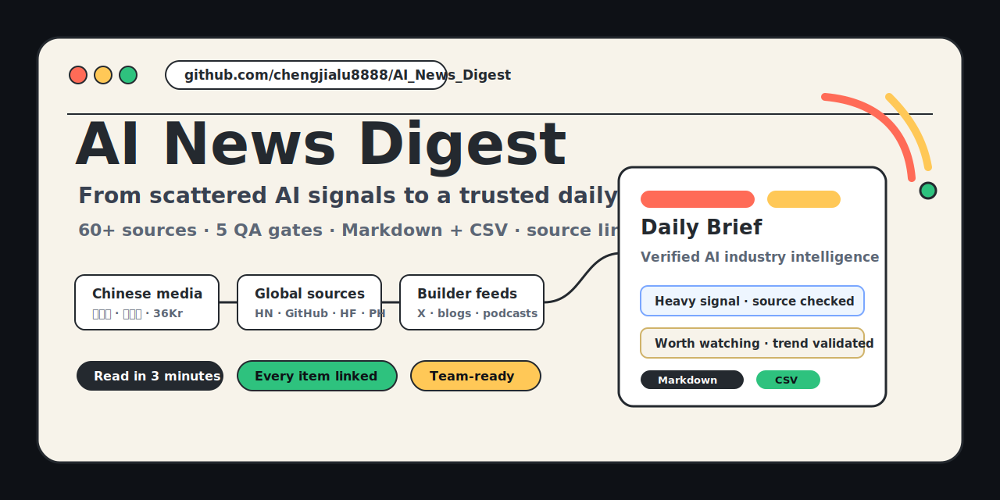
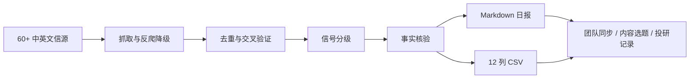
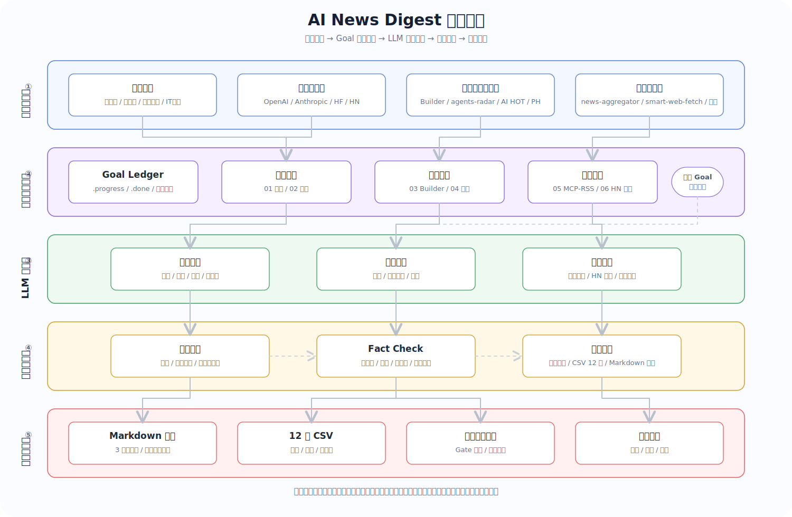

<p align="center">
  
</p>

<div align="center">

# AI News Digest

**把分散的 AI 动态，压缩成一份可验证、可追溯、可复用的行业日报。**<br>
**Turn scattered AI signals into a verified daily brief with source links and structured outputs.**

[](https://github.com/chengjialu8888/AI_News_Digest)
[](#source-system)
[](#trust-layer)
[](#outputs)
[](#license)

[中文](#中文) · [English](#english) · [快速开始](#快速开始) · [Quick Start](#quick-start) · [Source System](#source-system)

</div>

---

## 中文

AI News Digest 是一个面向 **AI 从业者、投资研究者、产品经理、内容创作者和开发者** 的日报生成引擎。它不是再做一个“AI 总结器”，而是把散落在中英文媒体、官方博客、GitHub、Hacker News、Hugging Face、X Builder 动态和 RSS Feed 里的信号，整理成一份可以直接阅读、追踪和二次加工的行业情报。

你可以用它每天生成：

- 一份 **3 分钟可读完** 的 AI 行业日报
- 每条新闻都带 **原始链接** 的可追溯摘要
- 带信号等级的内容筛选：重磅 / 值得关注 / 常规
- 可沉淀到表格、看板或知识库的 **12 列 CSV**
- 适合团队同步、选题会、投研记录和公众号素材库的结构化输出

## 它解决什么问题？

| 读者痛点 | 常见做法 | AI News Digest 的做法 |
| --- | --- | --- |
| 每天刷太多源，仍然怕漏掉大事 | 手动打开 10+ 网站、公众号和社群 | 60+ 信源分层巡检，一次生成日报 |
| 中文信息慢半拍，海外一手动态跟不上 | 等转译、等二次报道 | 英文官方源 + GitHub/HN/HF + Builder Feed 直接进入流程 |
| AI 生成新闻容易编链接、混事实 | 让通用模型直接总结 | 5 道 QA Gate：去重、交叉验证、事实核验、信号分级 |
| 有摘要但不能复盘来源 | 只保存最终文章 | 每条内容保留原文 URL，方便团队回溯和验证 |
| 日报只能阅读，不能运营 | 复制粘贴再整理 | Markdown + 12 列 CSV，方便进入表格、知识库和内容流水线 |

## 适合谁？

| 角色 | 可以怎么用 |
| --- | --- |
| AI 产品 / 运营 | 每天快速判断产品、模型、政策和竞品变化 |
| 投资 / 研究 | 收集融资、公司动态、技术趋势和早期项目信号 |
| 开发者 / Builder | 跟踪新工具、开源项目、论文、模型和 Agent 生态 |
| 内容创作者 | 建立稳定选题池，减少低质量转载和信息重复 |
| 团队负责人 | 把日报作为晨会、周会和行业同步材料 |

## 一眼看懂：工作流与产品架构

### 工作流



### 产品架构

<p align="center">
  
</p>

## Trust Layer

AI News Digest 的核心价值不是“写得更像日报”，而是让日报更可信。

质量检测环节的设计灵感来自 [Signex](https://github.com/zhiyuzi/Signex)：把分散信号先沉淀为可检查的数据，再通过 source health、去重、分析视角和反馈记忆，让日报不只是“聚合”，而是逐步变成一个可校准的情报工作流。

```text
Gate 1: 数据源健康检查  -> 信源是否正常返回、内容是否足够新
Gate 2: 去重与交叉验证  -> 合并同一事件，优先保留一手来源
Gate 3: 信号分级        -> 标记重磅、值得关注、常规信息
Gate 4: 事实核验        -> 检查公司名、时间线、数字、引用和链接
Gate 5: 完整性自检      -> 确认日报板块覆盖完整，无明显遗漏
```

## Source System

AI News Digest 使用 8 层信源系统，把“覆盖面”和“可靠性”拆开处理。

| Tier | 信源类型 | 价值 |
| --- | --- | --- |
| Tier 1-2 | 新智元、量子位、机器之心、36Kr、华尔街见闻、极客公园、IT之家等中文核心源 | 中文语境下的行业动态与本土化解读 |
| Tier 3 | TechCrunch、The Verge、Reuters、Bloomberg、Hugging Face、TLDR、GitHub 等英文源 | 海外一手发布与国际视角 |
| Tier 4 | aicpb.com、AIwatch.ai、Toolify.ai 等数据型来源 | 产品榜单、流量、热度和市场侧参考 |
| Tier 5 | [follow-builders](https://github.com/zarazhangrui/follow-builders)：25 位 AI Builder 的 X 动态、6 个 AI 播客、Anthropic/Claude 官方博客 | 捕捉社区里比媒体更早出现的 Builder 原创观点和弱信号 |
| Tier 6 | news-aggregator、smart-web-fetch、content-trend-researcher | 批量抓取、反爬降级、跨平台趋势验证 |
| Tier 7 | [agents-radar MCP](https://github.com/duanyytop/agents-radar) | GitHub、ArXiv、HN、HF、Product Hunt、Dev.to、Lobste.rs 等结构化 AI 生态数据 |
| Tier 8 | [AI HOT Feed](https://aihot.virxact.com/feed.xml) | 中文预处理的 AI 热点、官方发布与 KOL 观点 |

## Outputs

### Markdown 日报

```markdown
# AI 日报 2026-04-07

## 一句话总结
> 今天的主线：模型能力、Agent 工具链和 AI 基础设施继续加速。

## 偏 fact 类新闻

### 大厂动向
1. [重磅] OpenAI 发布新产品更新 -- 摘要... [[Source]](https://example.com)

### 初创 / 融资
### 生态 / 政策

## 偏观点类
## 海外建设者动态
## 质量审核报告
```

### CSV 结构化数据

| 日期 | 编号 | 板块 | 标题 | 信号等级 | 事实核验 | 关联公司 | 关联赛道 | 来源 | 原文URL | 摘要 | 是否推送 |
| --- | --- | --- | --- | --- | --- | --- | --- | --- | --- | --- | --- |

## 快速开始

### Claude Code

```bash
git clone https://github.com/chengjialu8888/AI_News_Digest.git ~/.claude/skills/ai-news-digest
```

### Codex

```bash
git clone https://github.com/chengjialu8888/AI_News_Digest.git ~/.codex/skills/ai-news-digest
```

### OpenClaw

```bash
git clone https://github.com/chengjialu8888/AI_News_Digest.git ~/skills/ai-news-digest
```

### Mira

```bash
cp -r ai-daily-report /opt/tiger/mira_nas/plugins/prod/<your_id>/skills/
```

### 其他个人助手

```bash
curl -L https://raw.githubusercontent.com/chengjialu8888/AI_News_Digest/main/ai-daily-report/SKILL.md -o ai-news-digest.system.md
```

安装后对你的助手说：“跑一下今天的 AI 日报”或“出一期适合团队晨会的 AI 行业日报”。通用个人助手可把 `ai-news-digest.system.md` 作为 System Prompt 使用。

## 项目结构

```text
AI_News_Digest/
├── ai-daily-report/
│   ├── SKILL.md
│   ├── evals/
│   └── examples/
├── news-aggregator-skill/
├── smart-web-fetch/
├── content-trend-researcher/
├── assets/
│   └── github-header.svg
├── ai-daily-report.skill
└── README.md
```

## Evaluation

| Test Case | Score | Grade |
| --- | ---: | --- |
| Standard Daily Report | 92 | A |
| Specific Company Focus | 90 | A |
| Multi-day Comparison | 88 | A- |
| **Mean** | **90.0** | **A** |

---

## English

AI News Digest is a daily intelligence engine for **AI operators, researchers, investors, builders, and content teams**. It turns scattered signals from Chinese and English media, official blogs, GitHub, Hacker News, Hugging Face, X builder feeds, and RSS sources into a verified daily brief.

It helps you produce:

- A readable AI industry brief in about 3 minutes
- Source-linked summaries for every news item
- Signal grading for what is important, interesting, or routine
- A 12-column CSV for databases, spreadsheets, dashboards, and knowledge bases
- A reusable workflow for team syncs, research notes, editorial planning, and market tracking

## Why Star This Repo?

Star this repo if you want a practical starting point for building a reliable AI news workflow:

- It focuses on **source-backed intelligence**, not generic summaries.
- It combines **Chinese context + international first-hand sources**.
- It ships with a reusable **Mira Skill / system prompt**.
- It outputs both **human-readable briefs** and **structured data**.
- It is designed to evolve as new AI sources, MCP servers, and feeds appear.

Tier 5 builder signals come from [follow-builders](https://github.com/zarazhangrui/follow-builders), which tracks 25 curated AI builders on X, 6 AI podcasts, and official Anthropic/Claude blog updates.

The QA workflow is inspired by [Signex](https://github.com/zhiyuzi/Signex): source health checks, signal convergence, analysis lenses, and feedback memory are adapted here for daily AI news production.

## Quick Start

### Claude Code

```bash
git clone https://github.com/chengjialu8888/AI_News_Digest.git ~/.claude/skills/ai-news-digest
```

### Codex

```bash
git clone https://github.com/chengjialu8888/AI_News_Digest.git ~/.codex/skills/ai-news-digest
```

### OpenClaw

```bash
git clone https://github.com/chengjialu8888/AI_News_Digest.git ~/skills/ai-news-digest
```

### Mira

```bash
cp -r ai-daily-report /opt/tiger/mira_nas/plugins/prod/<your_id>/skills/
```

### Other Personal Assistants

```bash
curl -L https://raw.githubusercontent.com/chengjialu8888/AI_News_Digest/main/ai-daily-report/SKILL.md -o ai-news-digest.system.md
```

After installation, ask your assistant: "Generate today's AI daily report" or "Create an AI industry brief for my team sync." For generic assistants, use `ai-news-digest.system.md` as the system prompt.

## How It Compares

| Dimension | AI News Digest | RSS Reader | Generic AI Summary | Manual Curation |
| --- | --- | --- | --- | --- |
| Source coverage | 60+ layered sources | Depends on subscriptions | Limited by model/tool access | Usually 5-10 sources |
| Freshness | Same-day source checks | Real-time but unfiltered | Often stale or incomplete | Same-day but slow |
| Fact verification | 5 QA gates | None | Risk of hallucinated claims | Manual and inconsistent |
| Source links | Required per item | Available but scattered | Often missing or fabricated | Partial |
| Output | Markdown + CSV | Raw feeds | Plain text | Varies by editor |
| Best for | Repeatable intelligence workflow | Reading feeds | Quick brainstorming | High-touch editorial work |

## License

MIT

---

<div align="center">

**If this saves you from one hour of AI news digging, give it a star and make tomorrow's brief easier to produce.**

</div>

> Note: The example report title, date, and `https://example.com` link above are placeholders used to show the output format. Replace them with real daily report data before publishing generated examples.
